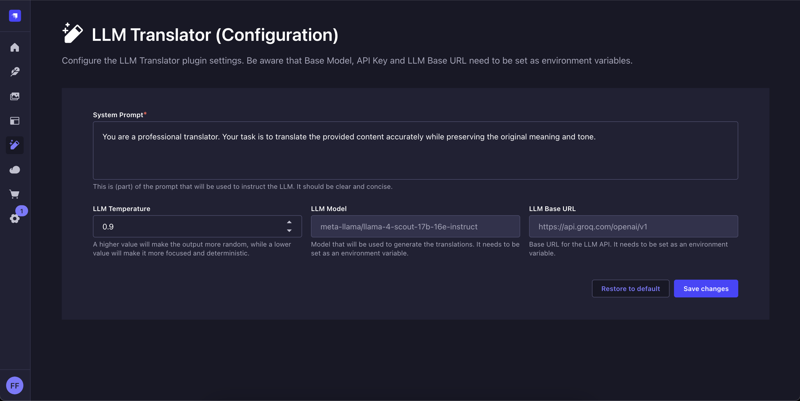
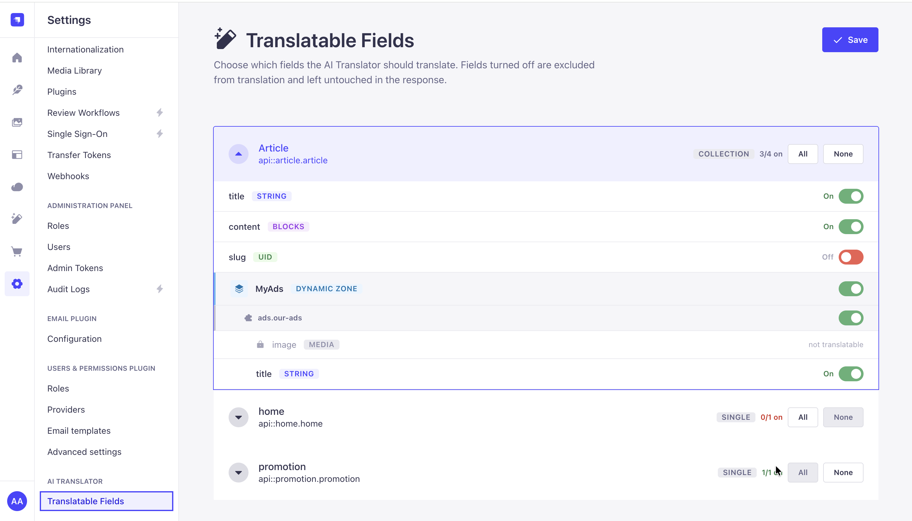
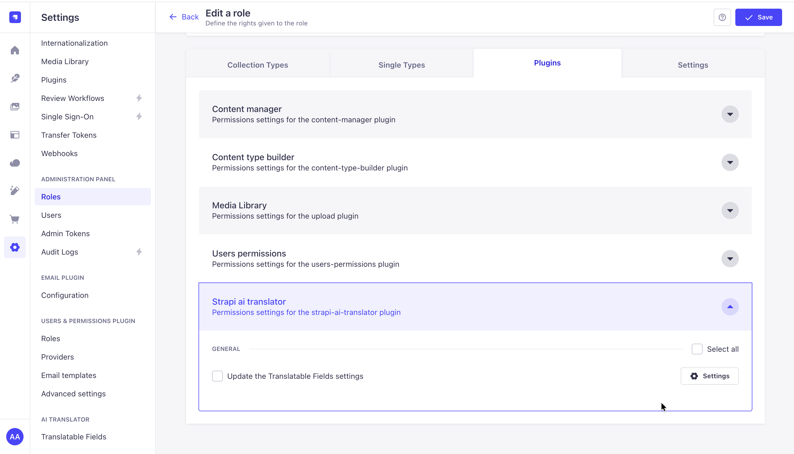

#  Strapi AI Translator

#### AI-Powered Content Translation for Strapi

> 🍴 **This is a fork of [Strapi LLM Translator](https://github.com/grenzbotin/strapi-llm-translator) by [grenzbotin](https://github.com/grenzbotin).**
> It continues development under the name **Strapi AI Translator**. Full credit for the original plugin goes to the upstream author and contributors.

The Strapi AI Translator plugin enhances your localization workflow by utilising LLMs to translate your content fields with a single click. Compatible with any OpenAI-compatible LLM, it preserves your original formatting while delivering fast, accurate results in seconds.

## 🚀 Key Features

- 🌍 **Multi-field Support** - Translates all text-based fields (string, text, richtext) and JSON/Blocks content, including Strapi 5 structured rich text
- 🔌 **LLM Agnostic** - Works with any OpenAI-compatible API (your choice of provider or local)
- 📝 **Format Preservation** - Maintains markdown formatting during translation
- 🔗 **Smart UUID Handling** - Auto-translates slugs when i18n is enabled with relative fields
- ⚡ **Auto-fill** - Instantly populates generated translations
- 🎛️ **Customizable** - Adjust system prompts and temperature for optimal results
- 🎯 **Field-Level Control** - Choose exactly which fields (and nested component / dynamic-zone sub-fields) get translated per content type, saved to the database
- 🔒 **Role-Based Access (RBAC)** - Control which roles can edit the translation configuration via a Strapi role permission

---


---

## ✅ Tested With

- **Strapi**: v5.12.x, v5.15.x
- **LLM Providers**:
  - OpenAI: `gpt-4o`
  - Google Gemini: `gemini-2.5-flash` — **free tier available** ✨ (via the OpenAI-compatible endpoint)
  - Azure OpenAI: `gpt-4.1`
  - Groq: `meta-llama/llama-4-scout-17b-16e-instruct`
  - Local: `Ollama`, e.g. `phi4-mini`

## 🛠️ Installation & Setup

### Prerequisites

- Strapi project (v5+)
- API key for your preferred LLM provider, Base Url + Model Name (+ API Version for Azure OpenAI)
- Configured internationalization with at least two languages in your Strapi application

### Installation

1. Install the plugin in your Strapi project:

```bash
npm install strapi-ai-translator-plugin
```

2. Configure your LLM provider via environment variables:

| Variable | Purpose |
| --- | --- |
| `LLM_TRANSLATOR_LLM_API_KEY` | Your provider API key (leave empty for keyless local LLMs) |
| `STRAPI_ADMIN_LLM_TRANSLATOR_LLM_BASE_URL` | Provider base URL (defaults to OpenAI's endpoint) |
| `STRAPI_ADMIN_LLM_TRANSLATOR_LLM_MODEL` | Model name (defaults to `gpt-4o`) |
| `STRAPI_ADMIN_LLM_TRANSLATOR_AZURE_API_VERSION` | Only required for Azure OpenAI |

👉 See [🔌 LLM Provider Setup](#-llm-provider-setup) below for ready-to-paste `.env` values for OpenAI, Gemini, Groq, Azure OpenAI, and Ollama.

3. Rebuild your admin panel:

```
npm run build
```

After installation, customize the translation behavior through the Strapi AI Translator configuration page:

---



---

## 🎯 Field-Level Translation Control

Not every field should be translated. Under **Settings → AI Translator → Translatable Fields**, choose exactly which fields the plugin translates — per content type, drilling all the way into components and dynamic zones.



- **Per-field toggles** — turn any translatable field on or off. Disabled fields are excluded from the LLM request and left untouched in the response.
- **Components & dynamic zones** — drill into nested component sub-fields individually. Non-translatable fields (media, numbers, relations…) are shown for context but can't be toggled.
- **Collection & single types** — every i18n-enabled content type is listed with an enabled/total counter and **All / None** shortcuts.
- **Persisted** — the configuration is stored in Strapi's plugin store (database), so it applies to every translation. Fields are translated by default until you explicitly turn them off.

### 🔒 Permissions (RBAC)

Saving this configuration is gated by a role permission. Under **Settings → Roles → _(role)_ → Plugins → Strapi AI Translator**, grant **"Update the Translatable Fields settings"**. Viewing the page is open to any authenticated admin; only saving requires the permission (the Super Admin role has it by default).



---

## 🔌 LLM Provider Setup

The plugin works with any **OpenAI-compatible Chat Completions API** and requests strict JSON output (`response_format: json_object`), so the provider/model must support **JSON mode**. Set the environment variables below for your provider of choice.

> ✨ **Want to start for free?** [**Google Gemini**](#google-gemini) has a **free API tier** — create a key in [Google AI Studio](https://aistudio.google.com/apikey) (no billing required) and start translating right away, subject to rate limits. For a fully offline/local option, use [Ollama](#ollama-local-free).

> ⚠️ Variables prefixed with `STRAPI_ADMIN_` are embedded into the admin bundle **at build time** — after changing them, rebuild the admin panel (`npm run build`).

### OpenAI (default)

```
LLM_TRANSLATOR_LLM_API_KEY=sk-...
STRAPI_ADMIN_LLM_TRANSLATOR_LLM_BASE_URL=https://api.openai.com/v1
STRAPI_ADMIN_LLM_TRANSLATOR_LLM_MODEL=gpt-4o
```

### Google Gemini

```
LLM_TRANSLATOR_LLM_API_KEY=<google-ai-studio-key>
STRAPI_ADMIN_LLM_TRANSLATOR_LLM_BASE_URL=https://generativelanguage.googleapis.com/v1beta/openai/
STRAPI_ADMIN_LLM_TRANSLATOR_LLM_MODEL=gemini-2.5-flash
```

> 🆓 **Free tier available** — get an API key from [Google AI Studio](https://aistudio.google.com/apikey); no billing required to start (subject to rate limits). Uses Gemini's OpenAI-compatibility endpoint.

### Groq

```
LLM_TRANSLATOR_LLM_API_KEY=gsk_...
STRAPI_ADMIN_LLM_TRANSLATOR_LLM_BASE_URL=https://api.groq.com/openai/v1
STRAPI_ADMIN_LLM_TRANSLATOR_LLM_MODEL=meta-llama/llama-4-scout-17b-16e-instruct
```

### Azure OpenAI

```
LLM_TRANSLATOR_LLM_API_KEY=<azure-api-key>
STRAPI_ADMIN_LLM_TRANSLATOR_LLM_BASE_URL=https://<resource>.openai.azure.com/openai/deployments/<deployment-name>
STRAPI_ADMIN_LLM_TRANSLATOR_LLM_MODEL=gpt-4.1
STRAPI_ADMIN_LLM_TRANSLATOR_AZURE_API_VERSION=2024-08-01-preview
```

> Azure is the **only** provider that uses `AZURE_API_VERSION`; setting it switches the plugin to the Azure client. The base URL is your Azure resource endpoint including the deployment path, and the model is your deployment name.

### Ollama (local, free)

```
# No API key required
STRAPI_ADMIN_LLM_TRANSLATOR_LLM_BASE_URL=http://localhost:11434/v1
STRAPI_ADMIN_LLM_TRANSLATOR_LLM_MODEL=phi4-mini
```

> Pull a model first (e.g. `ollama pull phi4-mini`). Great for local, zero-cost testing.

---

## 💻 Plugin Development

To contribute to the plugin development:

1. Navigate to your Strapi project
2. Add and link the plugin: `npx yalc add strapi-ai-translator-plugin && npx yalc link strapi-ai-translator-plugin && npm install`
3. Start your Strapi project
4. In a separate terminal, watch the plugin for changes:
   `npm run watch:link`

## 📄 License

Distributed under the MIT license. See `LICENSE` for more information.
